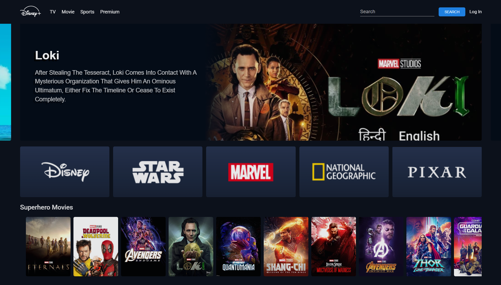

# Hotstar Clone
This repository consist of the code for Hotstar Clone.

# Output Preview
<figure>
  <figcaption>Website View (on desktop screen)</figcaption>
  
</figure>

<figure>
  <figcaption>Screenshot 1 (on desktop screen)</figcaption>
  
</figure>

# Disney+ Hotstar Clone

Welcome to the Disney+ Hotstar Clone! Recreate the magic of streaming movies, TV shows, sports, and more.

## Features
- Stream movies, TV series, live sports, and exclusive content.
- Powerful search with personalized recommendations.
- Responsive design for all devices.

## Getting Started
1. Clone the repo.
2. Set up dependencies.
3. Start the app and enjoy!

## Technologies
- **Frontend:** HTML, CSS, JavaScript

## Contribute
Enhance features, fix bugs, or add ideas via issues or pull requests. Dive into streaming with this project. Thank you!
